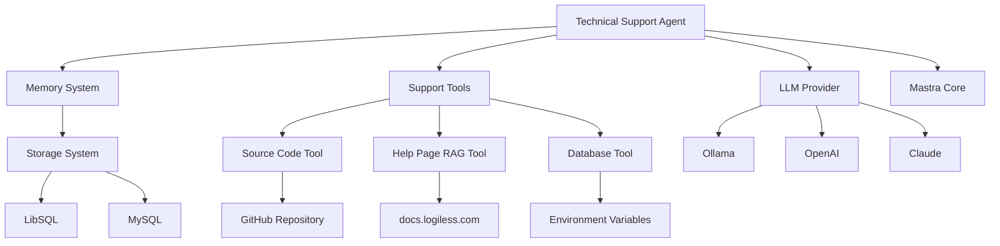

# 設計文書

## 概要

テクニカルサポートエージェントは、Mastraフレームワークを使用してアプリケーション内の技術的な問題解決支援を提供するAI駆動型エージェントです。このエージェントは、ユーザーとの自然言語対話を通じて、ソースコード検索、ヘルプドキュメント参照、データベース診断を活用した包括的な技術サポートを提供します。GitHub リポジトリ（logiless）、ヘルプページ（docs.logiless.com）、およびデータベース情報への統合アクセスにより、具体的で実用的な技術支援を実現します。

## ステアリング文書との整合性

### 技術標準（tech.md）
ステアリング文書は存在しませんが、既存のMastraプロジェクトの技術パターンと標準に従います：
- TypeScriptの使用とZodスキーマによる型安全性
- Mastraフレームワークのエージェント、ツール、メモリパターン
- 環境変数による設定の柔軟化
- 既存のコーディング規約とファイル構造

### プロジェクト構造（structure.md）
`src/mastra/agents/`ディレクトリ内にエージェントを配置し、既存の構造に従います。

## コード再利用分析

### 活用する既存コンポーネント
- **@mastra/core/agent**: エージェントの基本構造とAI統合
- **@mastra/memory**: 会話履歴とコンテキスト保持
- **LLMプロバイダー**: 環境変数による切り替え可能（Ollama/OpenAI/Claude等）
- **zod**: スキーマ定義と型安全性
- **@mastra/rag**: ヘルプページ検索システム
- **MCP filesync**: ソースコード検索機能

### 統合ポイント
- **Mastraインデックス**: `src/mastra/index.ts`でエージェント登録
- **メモリストレージ**: 環境変数による切り替え（LibSQL/MySQL等）
- **外部システム**: GitHub（ソースコード）、Help docs（RAG）、DB（接続情報）
- **ログシステム**: PinoLoggerによる統一ログ

## アーキテクチャ

テクニカルサポートエージェントは、既存のMastraアーキテクチャパターンに従ったモジュラー設計を採用します。エージェントは独立したモジュールとして実装され、必要に応じてツールやメモリシステムと統合します。

### モジュラー設計原則
- **単一ファイル責任**: 各ファイルは一つの具体的な関心事またはドメインを処理
- **コンポーネント分離**: 大きなモノリシックファイルではなく、小さく焦点を絞ったコンポーネントを作成
- **サービス層分離**: データアクセス、ビジネスロジック、プレゼンテーション層を分離
- **ユーティリティモジュラリティ**: ユーティリティを焦点を絞った単一目的のモジュールに分割



## コンポーネントとインターフェース

### テクニカルサポートエージェント
- **目的:** アプリケーション内の技術問題に対する包括的サポート提供
- **インターフェース:** Mastra Agent API（stream、generateText）
- **依存関係:** ollama LLMプロバイダー、Memory、Support Tools
- **再利用:** Mastra core Agent クラス、既存のメモリパターン

### サポートツール（Support Tools）
- **目的:** 技術診断と知識ベースアクセス機能
- **インターフェース:** Mastra Tool API（execute メソッド）
- **依存関係:** アプリケーションメタデータ、ログシステム、外部API
- **再利用:** @mastra/core/tools の createTool パターン

### ソースコード検索ツール
- **目的:** GitHub リポジトリからのソースコード検索と解析
- **インターフェース:** MCP filesync プロトコル
- **依存関係:** https://github.com/logiless/logiless
- **再利用:** MCP標準ツール

### ヘルプページRAGツール
- **目的:** ドキュメントサイトからの情報検索
- **インターフェース:** Mastra RAG API
- **依存関係:** https://docs.logiless.com/ のインデックス化
- **再利用:** @mastra/rag システム

### データベース接続ツール
- **目的:** DB状態確認とクエリ実行支援
- **インターフェース:** 環境変数ベースの接続設定
- **依存関係:** 設定可能なDB接続情報
- **再利用:** 既存のDB接続パターン

### メモリシステム
- **目的:** 会話履歴とユーザーコンテキストの永続化
- **インターフェース:** Memory API（store、retrieve）
- **依存関係:** 環境変数で設定可能なストレージ（LibSQL/MySQL）
- **再利用:** 既存の @mastra/memory パターン

## データモデル

### 会話コンテキスト
```typescript
interface ConversationContext {
  userId: string;
  sessionId: string;
  previousIssues: TechnicalIssue[];
  userSkillLevel: 'beginner' | 'intermediate' | 'advanced';
  preferredExplanationStyle: 'concise' | 'detailed' | 'step-by-step';
}
```

### 技術的問題
```typescript
interface TechnicalIssue {
  id: string;
  description: string;
  category: string;
  technology: string;
  status: 'open' | 'resolved' | 'escalated';
  resolution?: string;
  timestamp: Date;
  relatedCode?: SourceCodeReference[];
  helpDocuments?: HelpDocumentReference[];
}
```

### ソースコード参照
```typescript
interface SourceCodeReference {
  repository: string;
  filePath: string;
  lineNumber?: number;
  snippet: string;
  relevance: number;
}
```

### ヘルプドキュメント参照
```typescript
interface HelpDocumentReference {
  url: string;
  title: string;
  excerpt: string;
  relevance: number;
}
```

### サポート応答
```typescript
interface SupportResponse {
  content: string;
  type: 'troubleshooting' | 'explanation' | 'guidance' | 'code-analysis' | 'documentation';
  confidence: number;
  relatedResources?: {
    sourceCode?: SourceCodeReference[];
    documentation?: HelpDocumentReference[];
    databaseQueries?: string[];
  };
}
```

### 環境設定
```typescript
interface EnvironmentConfig {
  llmProvider: 'ollama' | 'openai' | 'claude';
  storageType: 'libsql' | 'mysql';
  githubRepository: string;
  helpDocsUrl: string;
  databaseConnection: {
    host?: string;
    port?: number;
    database?: string;
    // 認証情報は環境変数から取得
  };
}
```

## エラーハンドリング

### エラーシナリオ
1. **LLMサービス利用不可**
   - **対処:** フォールバック応答システムで基本的なガイダンス提供
   - **ユーザー影響:** 「現在システムメンテナンス中です。基本的なヘルプのみ提供可能です」

2. **メモリシステム障害**
   - **対処:** セッション内メモリでの一時的なコンテキスト保持
   - **ユーザー影響:** 「会話履歴の一部が利用できませんが、引き続きサポートを提供します」

3. **GitHub API制限**
   - **対処:** キャッシュされたソースコード情報の使用
   - **ユーザー影響:** 「最新のソースコード情報が取得できませんが、キャッシュ情報を使用します」

4. **ヘルプページRAG障害**
   - **対処:** 直接URLへのリンク提供
   - **ユーザー影響:** 「ドキュメント検索が利用できません。こちらのリンクを確認してください：[URL]」

5. **データベース接続エラー**
   - **対処:** 接続設定の確認を促す
   - **ユーザー影響:** 「データベースに接続できません。環境変数の設定を確認してください」

6. **不明な技術への質問**
   - **対処:** アプリケーション内サポート技術リストの提示
   - **ユーザー影響:** 「この技術はサポート対象外です。利用可能な技術は[リスト]です」

## テスト戦略

### 単体テスト
- エージェント応答生成ロジックのテスト
- 各ツール（ソースコード検索、RAG、DB接続）の実行とスキーマ検証
- メモリシステム統合の検証
- 環境変数による設定切り替えのテスト

### 統合テスト
- Mastraフレームワークとの統合
- 複数LLMプロバイダーとの通信
- 複数ストレージシステムとの永続化機能
- GitHub APIとMCP filesyncの統合
- RAGシステムとヘルプページの統合

### エンドツーエンドテスト
- 完全な技術サポートセッションのシミュレーション
- ソースコード参照を含む問題解決フロー
- ヘルプドキュメント検索を含む説明提供
- データベース関連の問題診断
- 複数の会話ターンでのコンテキスト保持
- 異なるユーザーシナリオ（初心者〜上級者）の検証